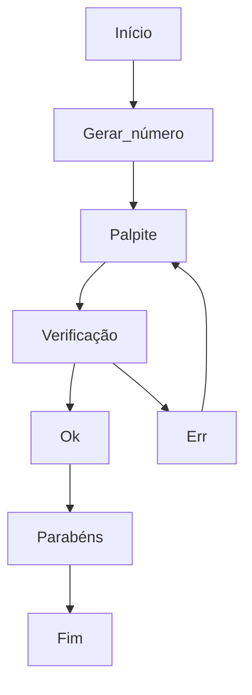

# Estudo de Rust 2

Repositório dedicado ao estudo da linguagem Rust, assim como o anterior [Estudo-de-Rust](https://github.com/MauricioPaivadaSilva/Estudo-de-Rust).

**Este repositório está sendo construido conforme EU estudo, sendo assim o mesmo NÃO segue uma sequência didática/pedagógica ou a própria sequência da documentação. Logo não espere um mini curso ou sequencia "correta" de estudos, pois este repositório só existe para meu próprio estudo e consulta. Está público, pois quero acessá-lo sem necessitar o login, caso seja necessário utilizar alguma informação presente aqui.**

---

## Base de estudo

O estudo da linguagem está se dando (em grande parte) com base na documentação do próprio [Rust](https://www.rust-lang.org/pt-BR).

---

### Sumário

* [Notas](#notas)
    * [Dia 1](#dia-1)
    * [Dia 2](#dia-2)
        * [Como funciona o Cargo](#como-funciona-o-cargo)
    * [Dia 3](#dia-3)
        * [Variáveis](#variaveis)
        * [Constantes](#constantes)
        * [Tipos de dados](#tipos-de-dados)

---

### Notas

#### Dia 1

* Programando um jogo de advinhação:
    * Objetivo: Gerar um número aleatório entre 1 e 100;
    * Esperar o palpite do jogador;
    * Indicar se o palpite está correto, se está muito baixo ou se está muito alto;
    * Caso esteja correto o jogo deve apresentar uma mensagem de parabéns e encerrar.

* Diagrama de funcionamento:


Usando a biblioteca `std` podemos permitir a comunicação pela entrada/saída `io` padrão do sistema, sendo assim, pela linha de comando. A importação é dada pelo `use`.

```Rust
use std::io;
```

O comando `let` declara que uma variável está sendo criada. O `mut` indica que a variável é mutável (mutabilidade será melhor definida mais a frente no estudo). Por fim, o trecho `String::new()` indica que o tipo de dado que será adicionado a esta variável é uma string.

```Rust
let mut num = String::new();
```

> [...] Rust, as variáveis são imutáveis por padrão, o que significa que uma vez que damos à variável um valor, o valor não vai mudar. [...]

Fonte: [https://doc.rust-lang.org/book/ch02-00-guessing-game-tutorial.html](https://doc.rust-lang.org/book/ch02-00-guessing-game-tutorial.html)

Observa-se que ao final de toda linha, há um ponto e vírgula ( ; ). **Nunca esqueça de colocar ao final da linha de comando um ( ; ).**

O `stdin` indica que vamos utilizar a função de input (entrada) do `io` que pertence ao `std`, isso faz com que a entrada utilizada seja a do terminal. Já o `read_line()` chama o método no identificador de entrada padrão para conseguir a entrada do usuário na linha. Por fim, o `&mut num` indica para o `read_line()` que o dado de entrada será armazenado na variável `num`. Observe que o `&` indica que o argumento é uma *referência*, o que é uma forma de acessar a mesma parte da memória em vários locais do código sem suplicar a parte da memória. Assim o `&mut num` torna o dado uma referênia mutável. **Usar `&num` para tentar tornar mutável está errado.**

```Rust
io::stdin().read_line(&mut num).except("Falha ao ler a linha.");
```
P.S.: A linha pode estar diferente no código devido a formatação da própria linguagem. O Rust tem um formatador que torna o código legível e "em formato Rust".

Como o `read_line()` retorna um `Result`, que varia entre `Ok` e `Err` (passou e falhou). Ao usar o `except()` com uma mensagem dentro dos parenteses, sempre que o `Result` for um `Err` ele apresentará a mensagem que você colocou, o que auxiliará na correção de possíveis problemas e erros no código. **Escreva sempre mensagens legíveis e relevantes nos `except()`.**

Finalmente, ao utilizar o `{}` dentro do `println!()` faz com que a variável declarada seja inserida dentro dele ao realizar o output (saida).

```Rust
println!("\nVocê chutou: {}", num)
```

Desta forma o `num` será inserido dentro dos `{}`. Outro exemplo pode ser visto abaixo

```Rust
let num1 = 1701;
let num2 = 42;

println!("A Enterprise tem o código numérico {num1}. E a resposta para tudo é {}", num2);
```

Agora para criar um número aleatório é necessário importar um módulo/biblioteca, para isso irei utilizar a mesma do exemplo da documentação, a `rand` que irá fornecer ao código a capacidade de gerar números "aleatórios". Para poder importar primeiro devo rodar o comando `cargo add rand` no terminal, após devo conferir o arquivo *Cargo.toml* se a biblioteca foi adicionada corretamente. Por fim, para importar o `rand` no código é necessário inserir `use rand::Rng;` no início do código.

A função `rand::thread_rng()` é o gerador de números "aleatórios" que será utilizado. O método `gen_range()` é o que gera os números aleatérios, sendo definido pelo `Rng`. O `gen_range()` recebe valores no formato `início..=fim`, incluindo o limite inferior e o limite superior.

```Rust
let secret_num = rand::thread_rng().gen_range(1..=100);
```

*Durante a construção do código que testa se o valor está acima, abaixo ou se está correto, foi necessário alterar a linha acima para que o valor gerado fosse armazenado como `String`, desta forma podendo comparar os dois valores, deixando o código da seguinte forma:*

```Rust
let secret_num = format!("{}", rand::thread_rng().gen_range(1..=100));
```

*Outra forma de corrigir o problema, e que é apresentada pela documentação é transformar o `num` em um número, adicionando a seguinte linha:*

```Rust
let num: u32 = num.trim().parse().except("Por favor, insira um número");
```

O `trim()` elimina qualquer caractere não imprimível antes e depois da string, o que permite transformar a string em um número. Já o `parse()` é o que finalmente converte a string em um número. De qualquer forma, se utilizar a primeira forma, terá que inseir o `trim()` no `match`, já se utilizar o segundo, no `match` o `trim()` é descartado.

Para poder comparar os valores é necessário adicionar a biblioteca `cmp`, da seguinte forma `use std::cmp::Ordering`. O Ordering é responsável por dizer se a comparação em ordenação é menor, igual ou maior. Note que o trecho de verificação das condições começa com `match`, ele é utilizado quando há uma tomada de decisão, assim como o `if`. A tomada de decisão ocorre quando ele encontra uma "combinação", ou seja, *a* combina com *b*.

```Rust
match num.trim().cmp(&secret_num) {
    Ordering::Less => println!("\nMuito abaixo!"),
    Ordering::Equal => println!("\n\tVocê ganhou!\n"),
    Ordering::Greater => println!("\nMuito acima!"),
}
```

Agora chega o momento de realizar o loop que possibilita aos usuário tentarem várias vezes até acertar. Assim trago um trecho da documentação:

> O que é `loop` palavra-chave cria um loop infinito. [...] para dar aos usuários mais chances de adivinhar o número [...]

Fonte: [https://doc.rust-lang.org/book/ch02-00-guessing-game-tutorial.html](https://doc.rust-lang.org/book/ch02-00-guessing-game-tutorial.html)

Para que o loop funcione corretamente, há uma condição que deve existir no `match`:

```Rust
...
loop{ 
    ...
    match num.trim().cmp(&secret_num) {
        Ordering::Less => println!("Muito abaixo!"),
        Ordering::Equal => {
            println!("\tVocê ganhou!\n");
            break;
        },
        Ordering::Greater => println!("Muito acima!"),
    }
}
```

O `break` faz com que o programa saia do loop, e como o loop é a última parte do programa, ele o `break` acaba finalizando o código também.

Para refinar mais ainda o código, é possível adicionar `match` no momento da conversão de `String` para `u32`, de forma a evitar erros. Trocando desta forma o `except()` pelo `match`.

*O [código](https://github.com/MauricioPaivadaSilva/Estudo-de-Rust-2/advinha) está no diretório advinha dentro deste repositório.*

---

#### Dia 2

Neste dia 2 eu acabei voltando para o item 1.3 da documentação, para entender um pouco de como funciona o cargo, já que ele é útil para todos os projetos Rust. O cargo não é necessário, mas é útil e recomendável útilizar.

##### Como funciona o Cargo

O Cargo é um facilitador para criação de projetos Rust, permitindo o gerenciamento de pacotes no projeto, compilação para desenvolvimento, compilação para distribuição, ... O Cargo utiliza o Cargo.toml para gerenciar o projeto.

* Cargo.toml

    Em seu cabeçalho o Cargo.toml trás algumas informações sobre o projeto necessárias para a compilação, a tag que abre este pedaço do código é `[package]` e o seu conteúdo é por exemplo:
    * Nome;
    * Versão;
    * Edição (ano que o projeto está iniciando).

    Após esta parte inicial, o arquivo trás informações das dependencias do arquivo, que tem como tag `[dependencies]` e trás informações como:
    * Nome da dependencia;
    * Versão da dependencia;
    * Em alguns casos também trás as features.

Ao compilar o código na primeira vez utilizando o Cargo, o mesmo irá gerar um arquivo chamado Cargo.lock. Este arquivo é responsável por manter o controle das verões exatas de todas as dependências utilizadas no projeto, a partir do momento que ele compila o projeto contendo aquela dependência pela primeira vez, o mesmo armazena dados sobre ela.

* Exemplo:

| Ação | Resultado |
| --- | --- |
| Criei o projeto | Cargo.lock ainda não é criado |
| Adicionei a dependencia sfml | Cargo.lock criado e adicionada informações acerca das dependencias necessárias, como: Nome da dependencia; Verão; "Onde encontrar" (sorce); checksum. |

O Cargo tentará manter essas dependencia neste estado para garantir o funcionamento do código, assim evitando a quebra de compatibilidade.

###### Comandos do cargo

| Comando | Ação |
| --- | --- |
| `cargo new` | Cria um novo projeto Rust. |
| `cargo add` | Adiciona a dependencia requerida |
| `cargo run` | Compila e roda o programa em modo de desenvolvimento |
| `cargo build` | Apenas compila o programa em modo de desenvolvimento |
| `cargo check` | Não compila o programa, mas faz as verificações do código e o compilador apresenta as saídas de erro. |


**Por padrão o cargo cria junto com o projeto um repositório git local, sendo o git o sistema de controle de verção utilizado por padrão dos projetos Rust.**

###### Adicionais aos comandos do cargo

`cargo [COMANDO] [ADICIONAIS]`

| Comando | Ação |
| --- | --- |
| `--release` | Ao ser utilizado junto do comando build, o cargo passa a compilar em formato de distribuição, sem o modo debug e com otimizações |
| `--help` | Ao ser utilizado com qualquer comando, permite ver uma ajuda acerca do comando |
| `--vcs=` | Ao ser utilizado com o comando de criação de projeto, permite escolher um sistema de controle de verção diferente do git. |

---

#### Dia 3

Neste dia 2 será trabalhadas as variáveis e mutabilidade.

##### Variáveis

Por padrão, todas as variáveis criadas em Rust são imutáveis, isso é proposital na linguagem para proporcionar segurança ao código.

_O compilador do Rust irá ajudar na **maioria** das vezes a corrigir  qualquer erro que exista no código, mas ele **não** faz mágica. É de responsabilidade de quem programa estudar o erro!_

##### Constantes

Constantes são a grosso modo como uma variável imutável, mas ainda assim há algumas diferenças entre os dois. Primeiramente, as contantes não admitem o atributo `mut` das variáveis, pois as constantes são eternamente imutáveis, sendo proibída toda e qualquer mudança após sua declaração.

Para declarar uma constante é utilizado `const` ao invés de `let`, assim como ao usar o `const` você DEVE declarar o tipo da constante.

Ao declarar uma constante, ela irá gerar o binário do valor junto com a compilação, sendo assim as constantes não são computadas em tempo de execução. Exemplo:

```Rust
const TRES_HORAS_EM_SEGUNDOS: u32 = 3 * 60 * 60;
```

No exemplo acima há uma conta, essa conta será realizada no momento da compilação e seu resultado será atribuído a variável, tornando-á um valor estático no momento da execução. É de bom tom utilizar todas as letras em maiúsculas quando se declara uma constante em qualquer linguagem, e em Rust isso não é diferente. Em Rust o próprio compilador indica isso.

_Note que o tempo de vida de uma constante em um código é o tempo de vida do escopo em que está inserida. Exemplo:_

```Rust
fn main() {
    println!("O valor da constante PI é: {}", pi());
}

fn pi() -> f32 {
    const PI: f32 = 3.141593;
    PI
}
```

Ao concluir a função `pi()` a constante saí de escopo, desta forma seu tempo de vida se encerra alí.

##### Tipos de dados

Rust é uma linguagem que exige conhecer o tipo de cada variável em tempo de compilação, o compilador pode inferir alguns tipos, mas é de obrigação do desenvolvedor declarar cada tipo de variável.

Exemplo de momento em que o compilador não consegue inferir o tipo de variável:

```Rust
let num: u32 = "42".parse().expect("Não é um número!");
```

Neste caso, como há uma mudança de `String` para `u32` o compilador não conseguiria inferir qual o tipo final, devendo ser inserido o tipo pelo desenvolvedor.

O Rust tem quatro tipos de dados por padrão: inteiros, números com ponto flutuante, booleanos e characters.

###### Tipos de inteiros

|   Comprimento |   Com sinal   |   Sem sinal   |
|   --- |   --- |   --- |
|   8 bits  |   `i8`    |   `u8`    |
|   16 bits |   `i16`   |   `u16`   |
|   32 bits |   `i32`   |   `u32`   |
|   64 bits |   `i64`   |   `u64`   |
|   128 bits    |   `i128`  |   `u128`  |
|   arch    |   `isize` |   `usize` |

Os números que podem ser armazenados nas variáveis inteiras com sinal são representados pela operação abaixo, em que `n` é o número de bits.

$-(2^{n-1})$ a $2^{n-1}-1$


Os números que podem ser armazenados nas variáveis inteiras sem sinal são representados pela operação abaixo, em que `n` é o número de bits.

$0$ a $2^{n}-1$

Para ficar legível é possível escrever números grandes com separação feita utilizando o `_`, como `1_000_000`. Isso é possível para números literais como:

|   Números literais    |   Exemplo |
|   --- |   --- |
|   Decimal |   `98_222`    |
|   Hex |   `0xff`  |
|   Octal   |   `0o77`  |
|   Binário |   `0b1111_0000`   |
|   Byte (Apenas `u8`)  |   `b'A'`  |

###### Tipos de ponto flutuante

Em Rust há apenas dois tipos de valores flutuantes possíveis, o `f32` e o `f64`, por padrão o Rust usará o `f64` devido a arquitetura moderna dos processadores.

###### Operações numéricas

O Rust suporta as quatro operações básicas: adição, subtração, multiplicação e divisão, mas também suporta o resto da divisão.

###### Tipo booleano

O tipo booleano é tratado em rust como `true` e `false`, recebendo a notação `bool`.

###### Tipo characters

O tipo alfabético `char` é utilizado quando trabalhamos com caracteres de 4 bytes de tamanho, representando um Unicode Scalar Value, podendo representar muito mais do que apenas o ASCII e é utilizado `''` para identificar.

###### Tipos compostos

Os tipos compostos representam mais de um tipo primitivo, como em tuplas e matrizes.

###### Tipo de tupla

Uma tupla é uma forma de agrupar uma série de valores de diferentes tipos, em um único tipo composto. Exemplo:

```Rust
let tupla: (u8, i8, char) = (9, -4, 'R');
```

A desestruturação de uma tupla pode ser feita de duas formas. Exemplo:

```Rust
fn main() {
    let tupla: (u32, i32, char) = (42, -15, 'R');

    // Primeira forma
    let (a, b, c) = tupla;

    // Segunda forma
    let a_resposta: u32 = tupla.0;
}
```

###### Tipo matriz

Outra forma de agrupar valores é utilizando um _array_, mas na matriz é necessário manter o mesmo tipo de dado em todos os valores presentes nela. Além disso, as matrizes tem tamanhos fixos (observação, aqui quando digo matriz pode ser interpretado como _array_ em outras linguagens).

```Rust
let matriz = [1, 2, 3, 4, 5];
```

```Rust
let matriz: [i32, 4] = [0, 1, 2, 3];
```

```Rust
let matriz = [2; 3];
```

O resultado é `let matriz = [2, 2, 2];`

Para acessar os elementos da matriz, pode-se utilizar `[]`, exemplo:

```Rust
let m = [1, 2, 3]

let um = m[0];
let tres = m[2];
```
