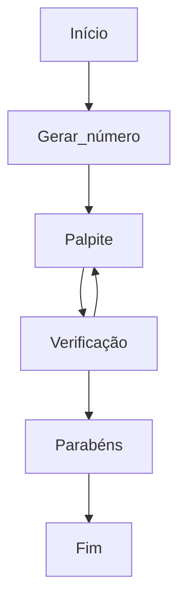

# Estudo de Rust 2

Repositório dedicado ao estudo da linguagem Rust, assim como o anterior [Estudo-de-Rust](https://github.com/MauricioPaivadaSilva/Estudo-de-Rust).

---

## Base de estudo

O estudo da linguagem está se dando (em grande parte) com base na documentação do próprio [Rust](https://www.rust-lang.org/pt-BR).

---

### Sumário

* [Notas](#notas)
    * [Dia 1](#dia-1)
        * [Resumo](#resumo-dia-1)

---

### Notas

#### Dia 1

* Programando um jogo de advinhação:
    * Objetivo: Gerar um número aleatório entre 1 e 100;
    * Esperar o palpite do jogador;
    * Indicar se o palpite está correto, se está muito baixo ou se está muito alto;
    * Caso esteja correto o jogo deve apresentar uma mensagem de parabéns e encerrar.

* Diagrama de funcionamento:


Usando a biblioteca `std` podemos permitir a comunicação pela entrada/saída `io` padrão do sistema, sendo assim, pela linha de comando. A importação é dada pelo `use`.

```Rust
use std::io;
```

O comando `let` declara que uma variável está sendo criada. O `mut` indica que a variável é mutável (mutabilidade será melhor definida mais a frente no estudo). Por fim, o trecho `String::new()` indica que o tipo de dado que será adicionado a esta variável é uma string.

```Rust
let mut num = String::new();
```

> [...] Rust, as variáveis são imutáveis por padrão, o que significa que uma vez que damos à variável um valor, o valor não vai mudar. [...]

Fonte: [https://doc.rust-lang.org/book/ch02-00-guessing-game-tutorial.html](https://doc.rust-lang.org/book/ch02-00-guessing-game-tutorial.html)

Observa-se que ao final de toda linha, há um ponto e vírgula ( ; ). **Nunca esqueça de colocar ao final da linha de comando um ( ; ).**

O `stdin` indica que vamos utilizar a função de input (entrada) do `io` que pertence ao `std`, isso faz com que a entrada utilizada seja a do terminal. Já o `read_line()` chama o método no identificador de entrada padrão para conseguir a entrada do usuário na linha. Por fim, o `&mut num` indica para o `read_line()` que o dado de entrada será armazenado na variável `num`. Observe que o `&` indica que o argumento é uma *referência*, o que é uma forma de acessar a mesma parte da memória em vários locais do código sem suplicar a parte da memória. Assim o `&mut num` torna o dado uma referênia mutável. **Usar `&num` para tentar tornar mutável está errado.**

```Rust
io::stdin().read_line(&mut num).except("Falha ao ler a linha.");
```
P.S.: A linha pode estar diferente no código devido a formatação da própria linguagem. O Rust tem um formatador que torna o código legível e "em formato Rust".

Como o `read_line()` retorna um `Result`, que varia entre `Ok` e `Err` (passou e falhou). Ao usar o `except()` com uma mensagem dentro dos parenteses, sempre que o `Result` for um `Err` ele apresentará a mensagem que você colocou, o que auxiliará na correção de possíveis problemas e erros no código. **Escreva sempre mensagens legíveis e relevantes nos `except()`.**

Finalmente, ao utilizar o `{}` dentro do `println!()` faz com que a variável declarada seja inserida dentro dele ao realizar o output (saida).

```Rust
println!("\nVocê chutou: {}", num)
```

Desta forma o `num` será inserido dentro dos `{}`. Outro exemplo pode ser visto abaixo

```Rust
let num1 = 1701;
let num2 = 42;

println!("A Enterprise tem o código numérico {num1}. E a resposta para tudo é {}", num2);
```

Agora para criar um número aleatório é necessário importar um módulo/biblioteca, para isso irei utilizar a mesma do exemplo da documentação, a `rand` que irá fornecer ao código a capacidade de gerar números "aleatórios". Para poder importar primeiro devo rodar o comando `cargo add rand` no terminal, após devo conferir o arquivo *Cargo.toml* se a biblioteca foi adicionada corretamente. Por fim, para importar o `rand` no código é necessário inserir `use rand::Rng;` no início do código.

A função `rand::thread_rng()` é o gerador de números "aleatórios" que será utilizado. O método `gen_range()` é o que gera os números aleatérios, sendo definido pelo `Rng`. O `gen_range()` recebe valores no formato `início..=fim`, incluindo o limite inferior e o limite superior.

```Rust
let secret_num = rand::thread_rng().gen_range(1..=100);
```

*Durante a construção do código que testa se o valor está acima, abaixo ou se está correto, foi necessário alterar a linha acima para que o valor gerado fosse armazenado como `String`, desta forma podendo comparar os dois valores, deixando o código da seguinte forma:*

```Rust
let secret_num = format!("{}", rand::thread_rng().gen_range(1..=100));
```

*Outra forma de corrigir o problema, e que é apresentada pela documentação é transformar o `num` em um número, adicionando a seguinte linha:*

```Rust
let num: u32 = num.trim().parse().except("Por favor, insira um número");
```

O `trim()` elimina qualquer caractere não imprimível antes e depois da string, o que permite transformar a string em um número. Já o `parse()` é o que finalmente converte a string em um número. De qualquer forma, se utilizar a primeira forma, terá que inseir o `trim()` no `match`, já se utilizar o segundo, no `match` o `trim()` é descartado.

Para poder comparar os valores é necessário adicionar a biblioteca `cmp`, da seguinte forma `use std::cmp::Ordering`. O Ordering é responsável por dizer se a comparação em ordenação é menor, igual ou maior. Note que o trecho de verificação das condições começa com `match`, ele é utilizado quando há uma tomada de decisão, assim como o `if`. A tomada de decisão ocorre quando ele encontra uma "combinação", ou seja, *a* combina com *b*.

```Rust
match num.trim().cmp(&secret_num) {
    Ordering::Less => println!("\nMuito abaixo!"),
    Ordering::Equal => println!("\n\tVocê ganhou!\n"),
    Ordering::Greater => println!("\nMuito acima!"),
}
```

Agora chega o momento de realizar o loop que possibilita aos usuário tentarem várias vezes até acertar. Assim trago um trecho da documentação:

> O que é `loop` palavra-chave cria um loop infinito. [...] para dar aos usuários mais chances de adivinhar o número [...]

Fonte: [https://doc.rust-lang.org/book/ch02-00-guessing-game-tutorial.html](https://doc.rust-lang.org/book/ch02-00-guessing-game-tutorial.html)

Para que o loop funcione corretamente, há uma condição que deve existir no `match`:

```Rust
...
loop{ 
    ...
    match num.trim().cmp(&secret_num) {
        Ordering::Less => println!("Muito abaixo!"),
        Ordering::Equal => {
            println!("\tVocê ganhou!\n");
            break;
        },
        Ordering::Greater => println!("Muito acima!"),
    }
}
```

O `break` faz com que o programa saia do loop, e como o loop é a última parte do programa, ele o `break` acaba finalizando o código também.

Para refinar mais ainda o código, é possível adicionar `match` no momento da conversão de `String` para `u32`, de forma a evitar erros. Trocando desta forma o `except()` pelo `match`.

*O [código](https://github.com/MauricioPaivadaSilva/Estudo-de-Rust-2/advinha) está no diretório advinha dentro deste repositório.*
